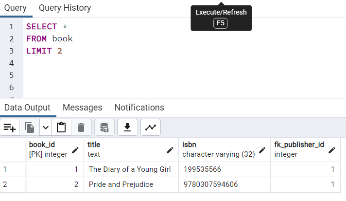

# **БАЗОВЫЕ ЗАПРОСЫ SELECT**

## Выборка данных из таблицы :

Для того что бы выбрать данные из таблицы нужно использовать оператор Select.


```
SELECT *
FROM passport
```
В данном случае * означает выборку всех столбцов и строк из таблицы passport.

## Фильтрованная выборка данных:

Для того что бы отфильтровать данные из таблицы необходимо вместо *, написать те столбы которые нам необходимы через запятую.
```
SELECT book_id, title, isbn
FROM book
```


## Операции в запросах select

Возможные операции с таблицами: 
 * сложение
 * вычитание
 * умножение
 * деление
 * степень
 * квадратный корень
 * множество др. операторов и функций

 Пример переумножения таблиц :


## Вывод уникальных значений 

Оператор DISTINCT выводит уникальные(единичные значение из любого столбца). Это подойдет если нам необходимо узнать например в каких странах проживают сотрудники.

```
SELECT DISTINCT fk_publisher_id
FROM book
```


## Функция count вмете с distinct

Данная функция показывает сколько всего строк в этой таблице.


Но для того что бы сделать фильтр в count, необходимо совместить эти две команды:


## Фильтрация - WHERE

В данном примере я вывел все строки которые соответствуют индексу 2 в столбце fk_publisher_id.

```
SELECT book_id, title, isbn
FROM book
WHERE fk_publisher_id = '2'
```


## AND, OR
С помощью команды AND и OR мы можем устанавливать сразу множество фильтров.


## BETWEEN 

Команда BETWEEN  устанвливает интервал(включая его значания):


```
SELECT *
FROM publisher
WHERE publisher_id BETWEEN 2 AND 4;

```

## Список - IN

Данная команда выдает список всех необходимых нам элементов. Так же есть команда NOT IN при использовании которой, нам выведет список не имеющих этих элементов.


```
SELECT *
FROM publisher
WHERE publisher_id IN (1,3,4)
```


## ORDER BY - упорядочивание результатов 

Команда ORDER BY выводит значения по возрастанию(по умолчанию), но если добавить DESC, то тогда значения будут по убыванию.


```
SELECT *
FROM book
ORDER BY title 

SELECT *
FROM book
ORDER BY title DESC
```

## SELECT MIN - нахождение минимального значения

Команда SELECT MIN находит минимальное значение при каком то условии. 


```
SELECT MIN(title)
FROM book
WHERE fk_publisher_id = 1
```

Так же существуют такие команды как:
 * SELECT MIN
 * SELECT MAX
 * SELECT AVG
 * SELECT SUM 

## Шаблоны - Pattern Matching with LIKE

Какие шаблоны существуют :

 * % - placeholder (заполнитель) означающий 0, 1 и более символов
 * _ровно 1 любой символ
 * LIКЕ U%' - строки, начинающиеся с U
 * LIKE %а' - строки, кончающиеся на а
 * LIKE %John% - строки, содержащие John
 * LIKE 1%n' - строки, начинающиеся на J, и кончающиеся на п
 * LIKE '_oh_' - строки, где 2, 3 символы - oh, а первый (1) и последний (4) - любые
 * LIKE ' 0h% - строки, где 2, 3 символы - oh,
первый - любой и в конце 0, 1 и более любых символов

Пример:


# LIMIT - колличество записей

С помощью данного ключевого слова можно установить лимит выходных данных. Пример :




# IS NULL, IS NOT NULL

Вывод со значением null или вывод всех элементов которые не равны null :

```
SELECT ship_city, ship_region, ship_country
FROM orders
WHERE ship_region IS NULL;

SELECT ship_city, ship_region, ship_country
FROM orders
WHERE ship_region IS NOT NULL;
```

# Объединения, пересечения и исключения

Объединение двух select (так же устраняет дубликаты):


```
SELECT registration
FROM passport
UNION
SELECT first_name 
FROM person

```
Конструкция UNION ALL - выводит объдинение select без устранения дубликатов.

Для пересечения использую конструкцию INTERSECT - которая, в выводит  только те строки, которые есть как в первом результирующем наборе, так и во втором (третьем и так далее), т.е. происходит пересечение этих строк.

SQL оператор EXCEPT используется для возврата всех строк в первом операторе SELECT, которые не возвращаются вторым оператором SELECT. Каждый оператор SELECT будет определять набор данных. Оператор EXCEPT извлечет все записи из первого набора данных, а затем удалит из результатов все записи из второго набора данных.


