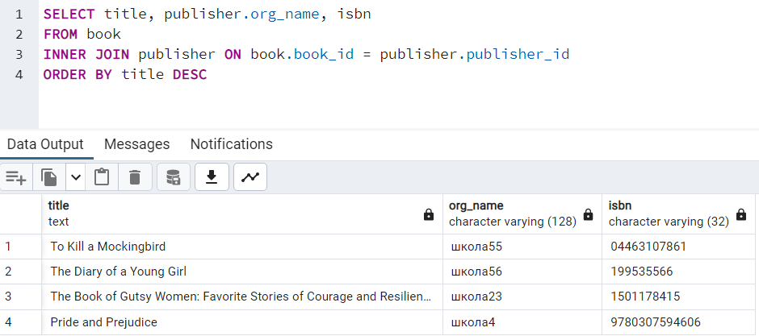
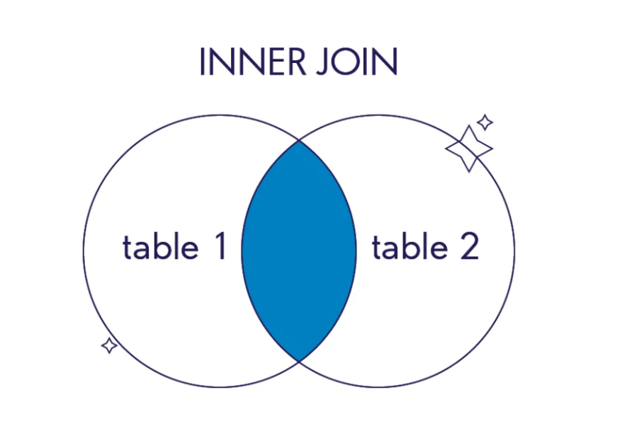
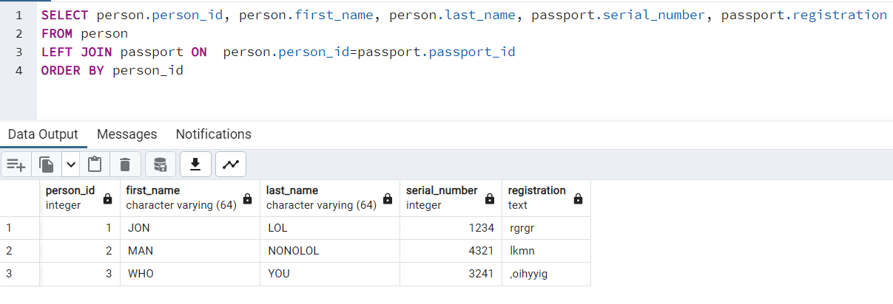
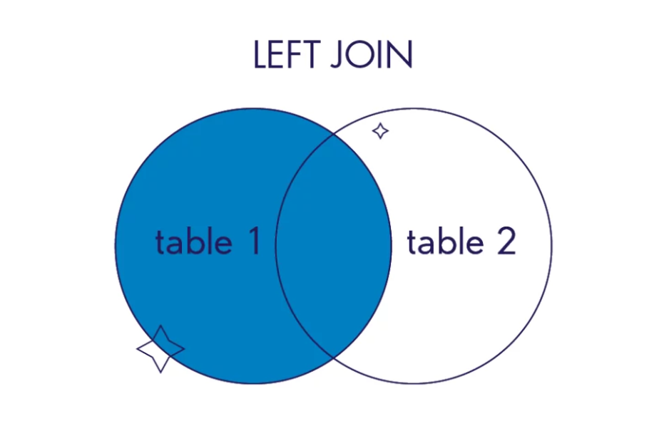
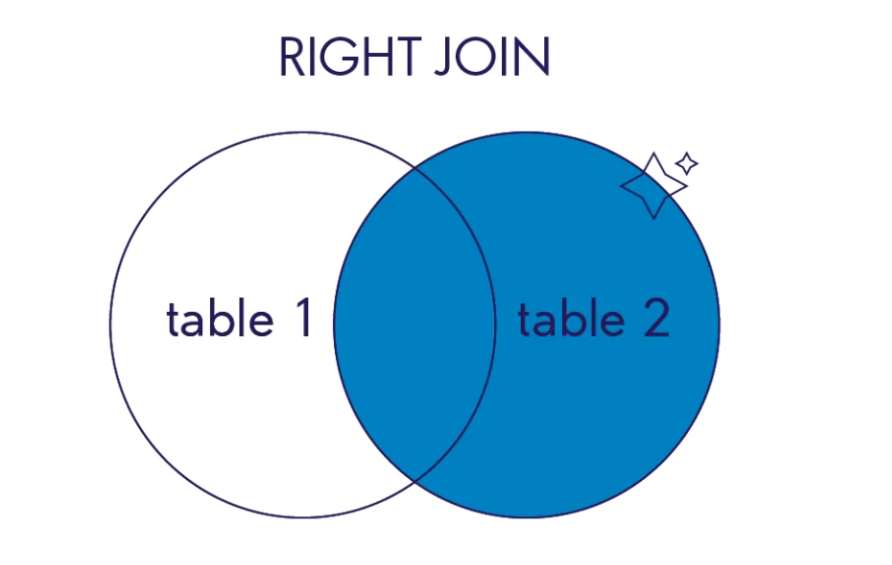
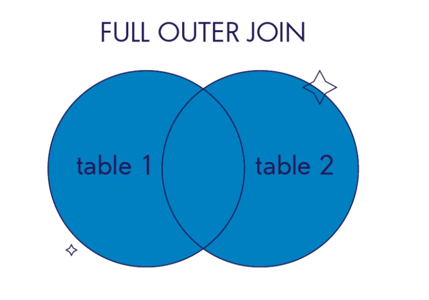
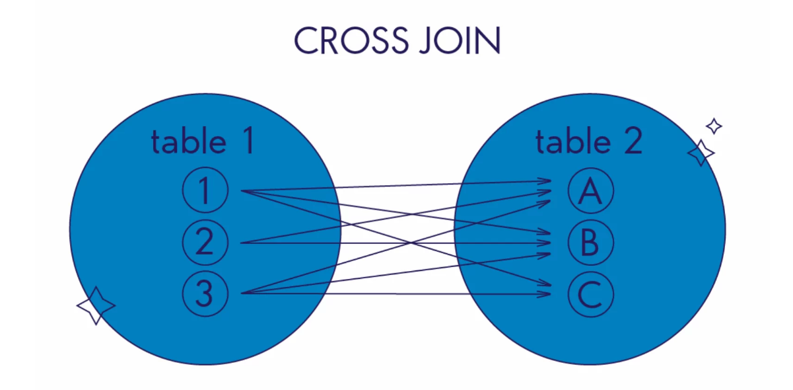

# Соединения (jOIN)
## Варианты соединений:

 * INNER JOIN
 * LEFT JOIN, RIGHT JOIN,
 * FULL JOIN
 * CROSS JOIN
 * SELF JOIN

## INNER JOIN

Пример внутреннего соединения:





## LEFT JOIN

В финальный результат такого соединения попадут все записи из левой, первой таблицы. Даже если не будет ни одного совпадения с правой. И записи из второй таблицы, для которых выполняется условие объединения.




## RIGHT JOIN

В финальный результат этого соединения попадут все записи из правой, второй таблицы. Даже если не будет ни одного совпадения с левой. И записи из первой таблицы, для которых выполняется условие объединения.



## FULL JOIN 

В финальный результат такого соединения попадут все записи из обеих таблиц. Независимо от того, выполняется условие объединения или нет.



## CROSS JOIN

Этот оператор отличается от предыдущих операторов соединения: ему не нужно задавать условие объединения (ON table1.column_name = table2.column_name). Записи в таблице с результатами — это результат объединения каждой записи из левой таблицы с записями из правой. Такое действие называют декартовым произведением.



## SELF JOIN

Его используют, когда в запросе нужно соединить несколько записей из одной и той же таблицы.

В SQL нет отдельного оператора, чтобы описать SELF JOIN соединения. Поэтому, чтобы описать соединения данных из одной и той же таблицы, воспользуйтесь операторами JOIN или WHERE.

Синтаксис соединения SELF JOIN при использовании оператора JOIN:

```
SELECT column_name(s)
FROM table1 a1
JOIN table1 a2
ON a1.column_name = a2.column_name;
```

Синтаксис соединения SELF JOIN при использовании оператора WHERE:
```
SELECT column_name(s)
FROM table1 a1, table1 a2
WHERE a1.common_col_name = a2.common_col_name;

```
