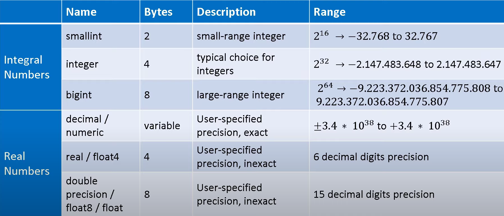

# **МЕТОДИЧКА ПО SQL**
## **Основные понятияeeetet**
**База данных (БД)** - набор взаимосвязанных данных.

**Система управления базами данных (СУБД)** - комплекс программных средств для управления данными.

*СУБД отвечает за: поддержку языка БД, механизмы и извлечения данных, оптимизацию процессов извлечения данных и т.д.*

## Реляционная модель 
**Сущность** - например, клиенты, заказы, поставщики

**Таблица** - отношение 

**Столбец** - атрибут

**Строка/запись** - кортеж

**Результирующий набор** - результат запроса SQL:
```
SELECT contact_name, address, city 
FROM customers
LIMIT 12
```


## SQL - Structured Query Language

  * Результатом SQL запроса является результирующий набор  (как правило - таблица)
  * DDL (Data Definition Language) - CREATE, ALTER, DROP
  * DML (Data Manipulation Language) - SELECT, INSERT, UPDATE, DELETE
  * TCL (Transaction Control Language) - COMMIT, ROLLBACK, SAVEPOINT
  * DCL (Data Control Language) - GRANT, REVOKE, DENY
  * ANSI SQL-92

*Различия в процедурных расширениях: PL/ pgSQL e PostgreSQL, PL/SQL Oracle, T-SQL MS SQL*
## Основные типы данных



### Другие типы данных
  * Arrays

  * JSON

  * XML

  * Геометрические типы и др. спец. типы

  * Custom-типы

  * NULL - отсутствие данных

 ## НАСТРОЙКА PGADMIN ПЕРЕД СОЗДАНИЕМ БД 
1.Для создания баззы данных необходимо нажать правой кнопкой мыши по Databases - Create - Database.


2.После чего должно появится окно с настройками БД:
для начального пользования необходимо лишь задать имя БД и нажать кнопку Save.


<!--3.Для создание таблицы необходмо развернуть Schemas вкладку и выбрать Tables.

-->

## ОСНОВНЫЕ КОМАНДЫ ДЛЯ УПРАВЛЕНИЯ БД
**УДАЛИТЬ БАЗУ ДАННЫХ:**

`DROP DATABASE testdb`

**СОЗДАТЬ БД:**

`CREATE DATABASE testdb;`

**Для создание таблицы** необходимо написать данный код:

```
CREATE TABLE publisher
(
	publisher_id integer PRIMARY KEY,
	org_name varchar(128) NOT NULL,
	address text NOT NULL
);

CREATE TABLE book
(
	book_id integer PRIMARY KEY,
	title text NOT NULL,
	isbn varchar(32) NOT NULL
);
```
**Для удаления таблиц:**
```
DROP TABLE publisher;
DROP TABLE book;
```
**Заполнение таблиц:**
```
INSERT INTO book 
VALUES 
(1, 'Алхмик'. '02329322329'),
(2, 'Алхмик2'. '02329392329'),
(3, 'Алхмик3'. '02329322329'),
(4, 'Алхмик4'. '0232932239'),
(5, 'Алхмик5'. '502329322329');

INSERT INTO publisher
VALUES
(1, 'школа56', 'рус')
(2, 'школа4', 'рус'),
(3, 'школа55', 'рус')
(4, 'школа23', 'рус')
```
## ОБЪЕДИНЕНИЕ ТАБЛИЦ
**Один ко многим:**

*Для начала удалим таблицу book.*
```
CREATE TABLE book 
(
	book_id integer PRIMARY KEY, 
	title text NOT NULL, 
	isbn varchar(32) NOT NULL,
	fk_publisher_id integer REFERENCES publisher(publisher_id) NOT NULL
)
```
```
INSERT INTO book
VALUES 

(1, 'The Diary of a Young Girl', '199535566', 1),
(2, 'Pride and Prejudice', '9780307594606', 1),
(3, 'To Kill a Mockingbird', '04463107861', 2),
(4, 'The Book of Gutsy Women: Favorite Stories of Courage and Resilience', '1501178415', 2),
(5, 'War and Peace', '1788886526', 2)
```

**Один к одному**
```
CREATE TABLE person
(
	person_id int PRIMARY KEY,
	first_name varchar(64) NOT NULL,
	last_name varchar(64) NOT NULL
);

CREATE TABLE passport
(
	passport_id int PRIMARY KEY,
	serial_number int NOT NULL,
	fk_passport_person int REFERENCES person(person_id)
)
```
Далее заполняем таблицу person и passport:
```
INSERT INTO person VALUES (1, 'JON', 'LOL');
INSERT INTO person VALUES (2, 'MAN', 'NONOLOL');
INSERT INTO person VALUES (3, 'WHO', 'YOU');
```
```
INSERT INTO passport VALUES (1, '1234', 'rgrgr', 1);
INSERT INTO passport VALUES (2, '4321', 'lkmn', 2);
INSERT INTO passport VALUES (3, '3241', ',oihyyig', 3 );
```

**Многие ко многим**
```
DROP TABLE book IF EXISTS;
DROP TABLE author IF EXISTS;
CREATE TABLE book
(
	book_id int PRIMARY KEY,
	title text NOT NULL,
	isbn text NOT NULL
)
CREATE TABLE author
(
	author_id int PRIMARY KEY,
	full_name text NOT NULL,
	rating real
)
```

```
INSERT into book
values
(
	(1, 'Book for Dummies', '123456'),
	(2, 'Book for Smart Guys', '78901231'),
	(3,'Book for Happy People', '4567890'),
	(4, 'Book for Unhappy People', '1234567')
);
insert into author
values
(
	(1, 'Bob', 4.5),
	(2, 'Alice', 4.8),
	(3, 'John', 4.7)
);
```
```
CREATE TABLE book_author
(
	book_id int REFERENCES book (book_id),
	author_id int REFERENCES author (author_id),
	
	CONSTRAINT book_author_pkey PRIMARY KEY book_id. author_id) 
);

INSERT into book
values
(1, 'Book for Dummies', '123456'),
(2, 'Book for Smart Guys', '78901231'),
(3,'Book for Happy People', '4567890'),
(4, 'Book for Unhappy People', '1234567')

insert into author
values
(
	(1, 'Bob', 4.5),
	(2, 'Alice', 4.8),
	(3, 'John', 4.7)
);

insert into book_author
values
(
	(1, 1),
	(2, 1),
	(3, 1),
	(3, 2),
	(4, 1),
	(4, 2),
	(4, 3)
);
```